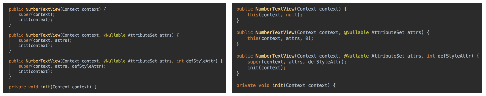
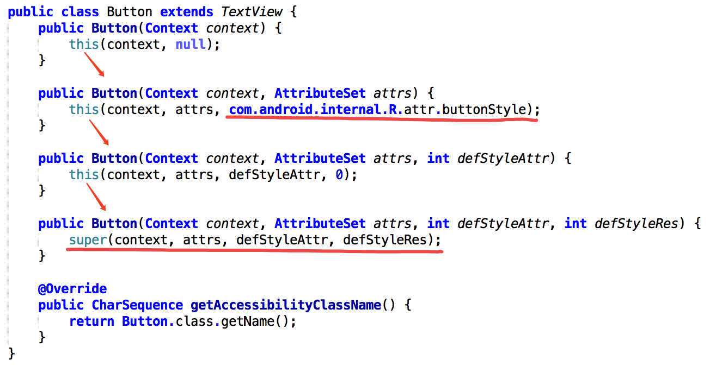
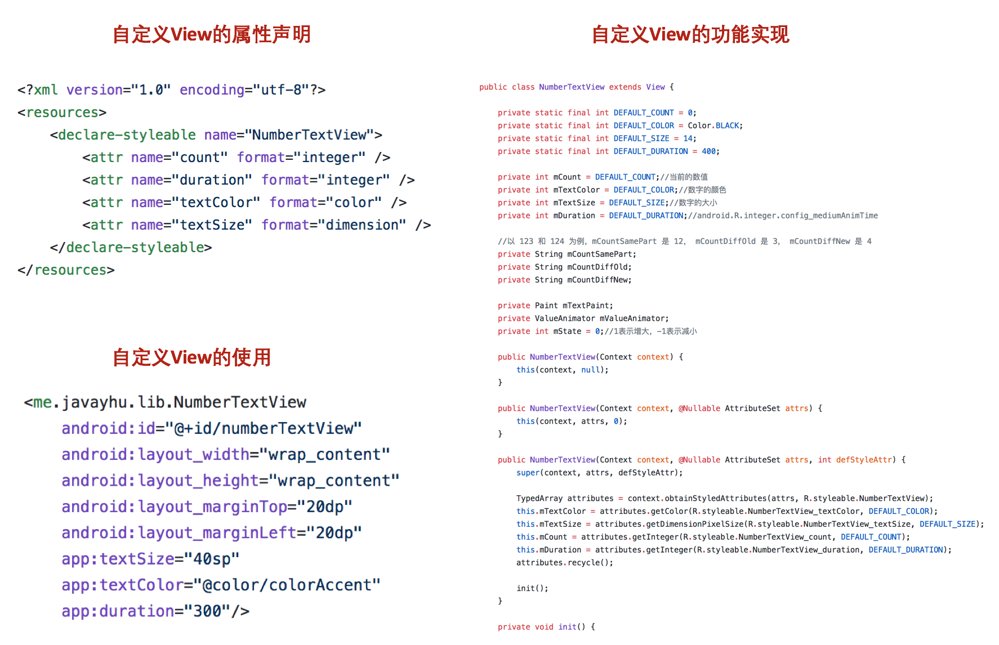
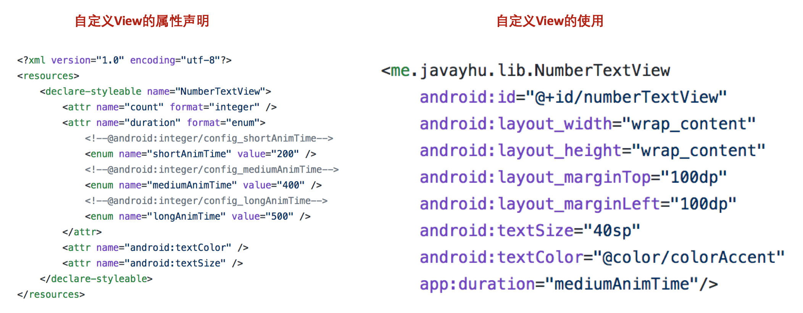
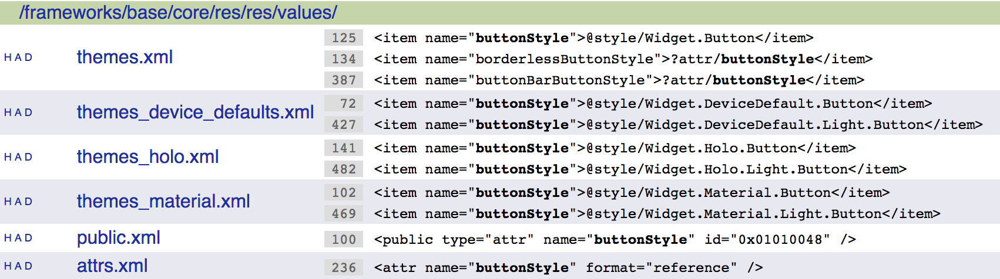
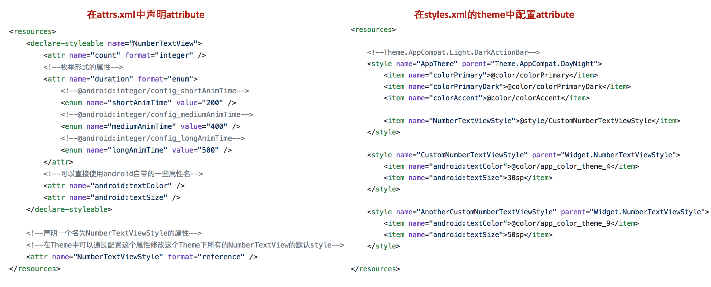
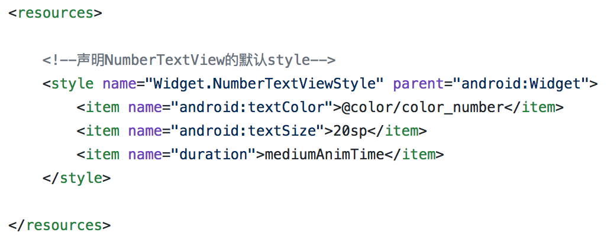
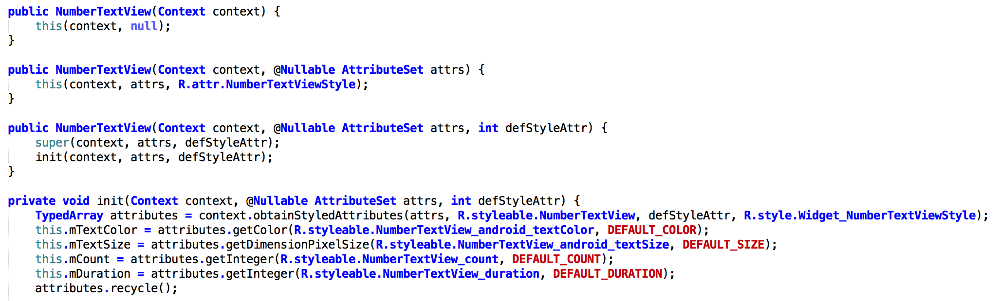
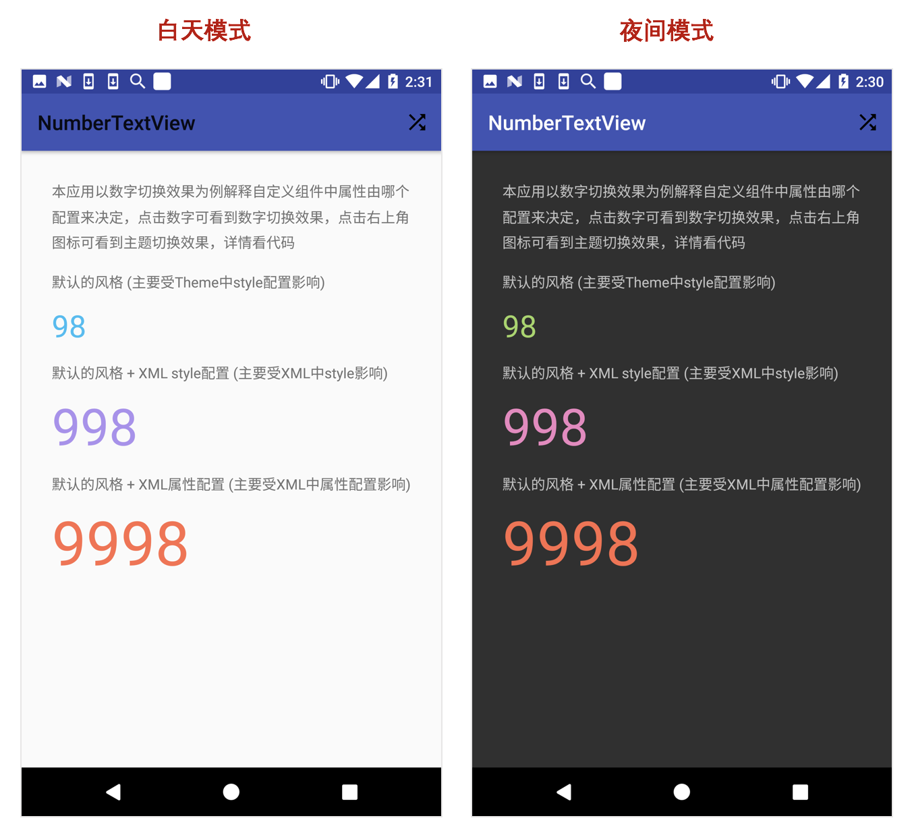

**自定义View的一些小知识**

本文主要介绍自定义View中我们比较容易忽视的一些小细节，下面内容我结合一个简单的自定义View的例子解释下我们可以如何让自定义View做得更好。这里的自定义View的例子是类似即刻应用中点赞时数字变换效果，代码地址：[NumberTextView](https://github.com/hujiaweibujidao/NumberTextView/)

### 1.自定义View的基本知识

**(1.1) 自定义View的一般步骤**

一般来说，自定义View往往有以下两个步骤：

1.创建一个继承自View或者某个具体View的类，在其中完成自定义View的主要功能；

2.创建一个 `attrs.xml` 文件，在其中声明这个自定义View支持的配置属性。

**(1.2) 自定义View的构造方法**

在自定义View类中一般会声明三个构造方法，构造方法的写法依据个人喜好往往有下面两种风格👇：一种是先调用super方法，然后再各自去调用统一的初始化方法；另一种是依次调用参数更多的那个方法，只在参数最全的那个方法中调用初始化方法。(注：Android源码中使用的是类似右边这种形式👉)

如果是在代码中用 `new NumberTextView(context)` 创建View的话，那么调用的是第一个构造方法；

如果是在XML中配置参数而创建View的话，那么调用的是第二个构造方法；

那第三个构造方法是什么情况下被调用呢？也许你猜想如果在XML配置的时候设置了style属性是不是就是调用第三个构造方法呢？其实不然，这种情况下调用的还是第二个构造方法，此时相当于将style中定义的属性和属性值拆出来注入到当前的View的属性键值对中。实际上第三个构造方法一般是不会被系统调用的，而是要我们来显式调用，例如上面右边的风格中第二个构造方法就是直接去调用第三个构造方法，并且传入的第三个参数是0，后面我们会详细介绍这个参数。（下图是Android源码中Button组件的定义）

**(1.3) 获取自定义View的属性值**

一般构造方法中要做的事情就是获取配置给自定义View的属性值，然后初始化自定义View中的某些成员变量，同时创建一些和绘制有关的对象，例如Paint等。下面是获取属性值的常用方法，得到的属性值就保存在 `TypedArray attributes` 中，`attributes.length()` 的值就是得到的属性值个数，`attributes.getString(index)` 就是第 `index` 个属性的属性值。

`TypedArray attributes = context.obtainStyledAttributes(AttributeSet set, int[] attrs);`

第一个参数 `set` 就是在XML中给View设置的属性，attrs中属性的顺序和XML中设置属性时的顺序可能不同，`set.getAttributeCount()` 的值就是设置的属性的个数，例如V1.0版本中(下图左下角)就包含了8个属性；

第二个参数`attrs` 就是我们自定义View声明的一些属性，一般传入的是 `R.styleable.xxx`，内容写在 `attrs.xml` 文件中，标签为`declare-styleable`，例如V1.0版本中(下图左上角)就声明了4个属性。

利用上面👆的知识我们很快可以写出即刻应用中点赞时数字变换的效果，参考代码：[v1.0](https://github.com/hujiaweibujidao/NumberTextView/tree/v1.0)，主要代码如下

**(1.4) 关于属性的声明**

NumberTextView有四个属性，其中 `textSize` 和 `textColor` 两个属性很类似TextView的那两个属性，那我们可不可以直接用 `android:textSize` 和 `android:textColor` 呢？答案是可以的！

此外，有些时候我们可能希望我们自定义View的某个属性的属性值是在某个数量有限且易于穷举的范围，以这里的动画时长属性 `duration` 为例，可能使用我们这个自定义View的开发者并不知道设置多大的时长比较合适，怎么办呢？这里我们可以考虑只给开发者提供几个值，例如Android系统原生配置的短动画时长 200ms、中等动画时长 400ms 以及长动画时长 500ms。写法如下：

[注：这里有个易错点，不能将枚举值设置为`short` 或者 `long` ，因为它们是Java中的关键词~]

老实说这个改动其实无伤大雅，个人喜好而已，我在一个Google开源项目中看到过前面提到的第一点的改动，也许可能maybe是个最佳实践吧。这样我们就得到[V2.0版本](https://github.com/hujiaweibujidao/NumberTextView/tree/v2.0)，下面我们在这个版本上再做些改进。

### 2.自定义View的知识进阶

前面我们回顾了自定义View的基本知识，并创建好了基础版本的NumberTextView。但是假设现在我有这么个需求，我不想每次使用这个组件的时候都要去设置它的字体颜色、字体大小还有动画时长等参数，我希望它在我不设置这些属性值的时候就能够很好的work，这该怎么办呢？很简单，不难发现之前的版本其实已经实现了这个功能，V1.0版本中右侧图片自定义View的实现中已经定义好了各个属性的默认值，只要修改这个默认值就可以了。

是的，上面的确是一种解决方案，但是，这样真的好吗？并不是所有使用你的自定义View的人都了解你的实现，知道如何修改默认值。而且，在一个应用中我们有可能希望不同的页面内有不同的默认风格，或者我们有可能有多个主题，我们还希望自定义View在不同的主题下会有不同的默认风格。当然，更棘手的是，如果我们还不能直接修改自定义View的实现文件，这又该怎么办？

也不难，用style对吧？只需要定义几种不同的style，然后在布局XML文件的自定义View中配置当前想要的style就行了。这个方案解决了不同的页面内有不同的默认风格的需求，那怎么解决在不同主题下有不同默认风格的需求呢？对于这样的需求，我们就不得不深入了解下自定义View中的一些细节。

**(2.1) 参数最全的获取View属性值的方法**

`TypedArray obtainStyledAttributes (AttributeSet set, int[] attrs, int defStyleAttr, int defStyleRes)`

前面我们已经分析了这个方法的第一个和第二个参数，下面我们来慢慢看下后面两个参数。

第三个参数 `defStyleAttr` 顾名思义就是用来指向默认style的attribute，也就是说它的本质是一个**attribute**，但是它是用来指向一个默认 **style** 的，那它是在哪里配置它指向哪个style的呢？答案是在Theme中配置的。**当在布局XML和style中都没有指定View的某个属性值时，就会从Theme中这个attribute指向的style中查找相应的属性值，如果有的话就用这个值作为这个属性的默认值。但是如果在Theme中没有给这个attribute赋值或者赋值为0的话表示不向Theme中搜索默认值。**

前面我们看到Android源码中Button组件的第二个构造方法传给第三个构造方法时的最后一个参数是 `com.android.internal.R.attr.buttonStyle`，这就是Android系统声明的可以用来修改Button样式的attribute，从下图中可以看出，Android系统中不同的Theme下都给Button组件设置了不同的style。

第四个参数 `defStyleRes` 看起来也是用来定义默认style的，而且它是**直接指向一个默认style**，但是呢，它却不一定能够生效！这个style中声明的属性值的优先级特别低，只有当前面的 `defStyleAttr` 为0或者 `defStyleAttr`  不为0但Theme中没有为  `defStyleAttr`  属性赋值时才起到作用。

[如果还没有很清楚的话，可以参考阅读[Android中自定义样式与View的构造函数中的第三个参数defStyle的意义](http://www.cnblogs.com/angeldevil/p/3479431.html)这篇文章，它更加详细地解释了这几个参数的作用。]

**(2.2) 属性值的优先级高低**

经过前面的介绍我们知道了属性值有下面的优先级顺序：

**布局XML文件 > XML中指定的style > Theme中指定的style > 默认指定的style**

OK，有了前面的进阶知识，下面我们看下如何改进吧

**（1）定义defStyleAttr**

首先是在 `attrs.xml` 中定义一个attribute，然后在Theme中配置它。这里我在demo应用中右上角增加了一个主题切换按钮，点击即可在白天模式和夜间模式之间切换。这里用了AppCompat中提供的夜间模式实现方案，新建了`values-night` 目录，并在其中的 `styles.xml` 中稍微修改了NumberTextView的字体颜色。

**（2）定义defStyleRes**

接着在 `styles.xml` 中定义一个style，这个style就是指第四个参数 `defStyleRes`。

**（3）改进构造方法**

修改NumberTextView的第二个构造方法，将默认的 `defStyleAttr` 改为了刚刚声明的 `R.attr.NumberTextViewStyle`，然后在初始化方法中使用四个参数的版本，另外第四个参数使用刚刚声明的 `R.style.Widget_NumberTextViewStyle`。

[注：如果你的应用的minSDKVersion是21的话，那么其实还可以声明第四个构造方法，也就是包含4个参数的最全的那个构造方法，如果低于21的话那就没有必要声明第四个构造方法]

经过上面的改进，我们就得到了[V3.0]()，下图是demo的图示，三个不同的NumberTextView主要受到不同地方的属性配置的影响，你也可以修改代码查看效果来验证本文的结论。

[前面两个NumberTextView在白天模式和夜间模式下的字体颜色是不同的，这些都不需要修改自定义View的实现代码，只需要在合适的位置配置相应的属性值就可以了]

其实，自定义View中还有很多的小细节，例如对编辑模式更友好些，避免只显示一个类名在Preview视图中，还有对于View在异常情况下进行数据保存和恢复的工作等等，以后有空了再深入研究下。

参考文档：

1.[Android中自定义样式与View的构造函数中的第三个参数defStyle的意义](http://www.cnblogs.com/angeldevil/p/3479431.html)

2.[从 View 构造函数中被忽略的 {int defStyleAttr} 说起](https://blog.lujun.co/2017/05/09/ignored-parameter-defStyleAttr-in-view-construct/)

3.[A deep dive into Android View constructors](http://blog.danlew.net/2016/07/19/a-deep-dive-into-android-view-constructors/)

